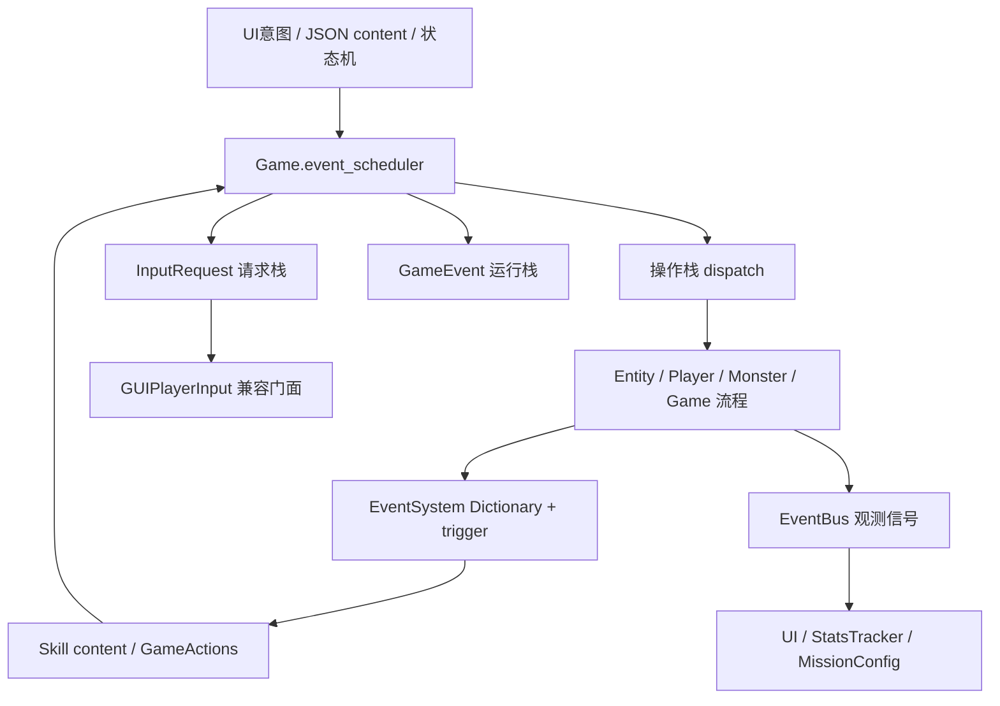

# EventScheduler 统一事件调度

> 以 `src/core/event_scheduler.gd` 为准。类名 `EventScheduler`，继承 `RefCounted`。
> **每局唯一实例**：由 [Game](../Game/Game.md) 持有 `event_scheduler`；`_ready()` / 新对局重置时 `new()`，旧实例 `reset()`。
> 生产代码不再创建局部调度器；`GameActions`、实体流程、GUI 输入、弹窗/座位 HUD 都注入或回落到 `Game.event_scheduler`。
> 已删除 `OperationRuntime`。领域操作、输入请求、`GameEvent` 运行栈均由本类承担。

---

## 一、三层分工（不要混用）

当前对局同时存在三套「事件」相关机制，职责不同：

| 层 | 类型 | 职责 | 不是什么 |
|---|---|---|---|
| **EventScheduler** | 每局实例 | 领域操作入栈执行、输入请求 LIFO、`GameEvent` 运行栈与父子挂接 | 不是 UI 信号总线，也不是 JSON 技能的 Dictionary schema |
| **EventSystem** | 静态工具 | JSON / `Entity.trigger` 用的 Dictionary 事件工厂与 `cancel` | 不是调度器；不持有运行栈 |
| **EventBus** | autoload 信号 | 结算后的只读通知（UI、统计、任务转发） | 不是规则调度器；订阅者不得推进流程 |

JSON 技能仍写 `EventSystem.cancel(event)` 与 `event.num` 等 Dictionary 字段；领域操作（伤害、抓牌、移动等）则先 `scheduler.dispatch(name, executor)`，在 executor 内再构建 Dictionary 并 `trigger`。

---

## 二、GameEvent 统一节点

对齐代码：`src/core/game_event.gd`。

所有调度节点共享同一套生命周期字段：`id`（非零递增）、`type`、`owner`、`source`、`parent`、`root`、`status`、`completion`（调度完成值；JSON schema 的 `event.result` 在 `data` 里，避免撞名）、`error`、`data`、`context`、`children`。

| Status | 含义 |
|--------|------|
| `PENDING` | 已创建，尚未运行 |
| `RUNNING` | 正在执行 |
| `COMPLETED` | 正常结束 |
| `CANCELLED` | 已取消 |
| `FAILED` | 执行器无效或显式失败 |

终态（`COMPLETED` / `CANCELLED` / `FAILED`）不可逆：后续 `complete()` / `cancel()` / `fail()` 不得覆盖已结束状态。

子类：

| 类 | 文件 | 现状 |
|---|---|---|
| `InputRequest` | `input_request.gd` | 继承 `GameEvent`；走独立请求栈；`enqueue_input` 同时 `add_child` 到 `get_current_event()` |
| `TurnEvent` | `turn_event.gd` | 正式回合节点；`start_turn` / 第零轮经 `run_event` 进入运行栈。`begin_turn_context` 仅测试/手动路径：立即 `mark_running`，不入栈 |
| `PhaseEvent` | `phase_event.gd` | 阶段跨度节点；作为 `TurnEvent` 的 child，经 `run_turn_phase` → `run_event` 贯穿该阶段 |

嵌套领域操作在 `dispatch` 时由 `create_event` → `_attach_event` 挂到 `get_current_event()` 上，形成操作子树。

---

## 三、操作栈

### 3.1 dispatch / enqueue / flush

| 方法 | 行为 |
|------|------|
| `dispatch(name, executor, payload, owner, source, kind, rules, context)` | 立即入运行栈并 `await` 执行器；嵌套调用自动成为当前操作的子事件 |
| `enqueue(...)` | 只登记到 `_operations` 队列，不立即执行 |
| `flush()` | 按登记顺序 `await` 队列中的操作；重入时直接 return |

当前 `GameActions` 的公开方法几乎全部内部 `await dispatch`（立即结算）。`enqueue` / `flush` 仍保留：`Skill.execute_content` 在自建 `GameActions` 时，content 返回后会 `await actions.flush()`，以排空若有的排队操作。

**回合排队不走这套 `_operations`。** 技能 `flush()` 只排空领域操作，不得执行或丢弃尚未开始的玩家回合。

操作句柄是 Dictionary（兼容旧 `OperationRuntime` 调用方），关键字段：`operation_name` / `payload` / `status` / `result` / `error` / `parent` / `owner` / `source` / `kind` / `rules` / `context` / `executor` / `game_event`。`EventSystem.cancel(operation)` 可在 `flush` 前取消尚未执行的排队操作。

`owner` / `source` / `kind` / `context` 默认继承自栈顶父操作；显式传入则覆盖。

### 3.2 查询

| 方法 | 返回 |
|------|------|
| `get_current_event()` | 运行栈最内层 `GameEvent`，空则 `null` |
| `get_current_owner()` / `get_current_source()` | 当前事件的 owner / source |
| `get_current_operation()` | 当前操作 Dictionary，空则 `{}` |
| `get_current_context()` | 当前操作的 `context` Dictionary |

### 3.3 有限行动上下文

`create_limited_action_context(owner, source, action_count, allowed_action_types)` 生成临时预算，供 `execute_action_immediately` 等跨玩家操作使用。字段包括 `kind: "limited_action"`、`remaining_actions`、`consumed_actions`、`allowed_action_types`、`cancelled` 等。

Player 的 **effective API**（`get_effective_phase` / `get_effective_action_count` / `can_afford_action`）优先读调度器当前有限上下文，否则读正式 `TurnContext`，再回退 `in_phase` / `action_count` 镜像。有限行动**不得改写**正式回合的 `TurnContext`。

### 3.4 收束规则

- 执行器 Callable 无效 → 操作 `failed`，对应 `GameEvent.fail`
- 已取消的操作（Dictionary `cancelled` 或 `game_event` 已 `CANCELLED`）不再执行
- `run_event` 在 `await executor` 之后若事件仍未终态，才 `complete(result)`
- `reset()` 取消活动输入、事件栈、操作栈与排队队列，供新对局使用

省略 `runtime` 时，实体方法回落到 `Game.event_scheduler`，**不再**临时 `new` 局部调度器。调用方若已持有 scheduler（嵌套 `dispatch` / `GameActions.runtime`），必须传入以保持父子关系。

### 3.5 回合队列

与 `_operations` 隔离的 `_turn_queue`（玩家引用，队首下一回合）。

| 方法 | 行为 |
|------|------|
| `enqueue_turn(player, extra=false)` | 标准回合追加到队尾；`extra=true` 插入队首 |
| `pop_turn()` | 弹出队首玩家；空则 `null` |
| `has_pending_turns()` / `get_pending_turn_players()` / `set_pending_turn_players` / `clear_turn_queue()` | 查询与整体替换 |

[GameStateMachine](GameStateMachine.md) 的 `turn_queue` 是该队列的门面。`next_turn` 仍按回合循环（队列空则填充新一轮，每回合后 `check_win_condition`），不能把整局一次性 `flush`。跳过标记仍在状态机 `skip_turn_marks`：轮到该玩家时消费一次。执行时才 `start_turn` 创建 `TurnEvent`，不在入队时预建。

`reset()` 同时清空回合队列。

---

## 四、输入请求栈

`InputRequest` 是带 `request_id`（即 `GameEvent.id`）与 `owner` 的外部等待节点。

| 方法 | 行为 |
|------|------|
| `enqueue_input(owner, emit_fn, preemptible=false)` | 创建请求。仅当当前活动请求未响应且 `preemptible` 时才将其压栈暂停，然后派发新请求 |
| `wait_request(request)` | 等到 `received`，释放活动槽，弹出栈顶外层请求重新 `emit` |
| `respond(value, request_id, owner)` | 必须同时匹配当前活动请求的 id 与 owner；过期 id、错误 owner、无活动请求一律忽略 |
| `get_current_input_request()` 等 | UI 只读观察当前活动请求；不暴露整栈 |

约定：

- 只有 `wait_action` 一类请求标 `preemptible`。选牌/确认等插入结算会盖住它，结算后 LIFO 恢复。
- `show_card` / `set_prompt` 仍是 fire-and-forget，不创建等待节点。
- [GUIPlayerInput](../../Engineering/GodotProjectStructure.md) 保留旧 signal / `respond_*` API，内部全部委托本调度器。
- 系统级请求也必须有明确 owner，不能用 `null` 表示「任意 owner」。
- `enqueue_input` 会把 `InputRequest` `add_child` 到 `get_current_event()`（无当前事件则为根）。

**与领域 owner 分离**：`GameEvent.owner` 是规则执行者；`InputRequest.owner` 是当前需要输入的玩家；`GameStateMachine.current_player` 是真实回合玩家。UI 高亮真实回合，交互路由看当前 `InputRequest`。

---

## 五、与 EventSystem 流程事件的衔接

`EventSystem.create_event()` 返回 `GameEvent`。流程字段在 `data` 里。JSON（CodeExecutor 动态脚本）可用 `event.num`、`event.get("card", null)`、`event["cancel"].call()`。项目内静态脚本对 `GameEvent` 应使用 `event["card"]`、`event.get_or("card", null)` 或 `EventSystem.get_field`，不要写两参 `event.get(key, default)`（引擎 `Object.get` 只接受 1 个参数）。取消用 `EventSystem.cancel(event)`。

无显式 `parent` 时，新节点挂到 `Game.event_scheduler.get_current_event()`。

技能 content 编译时自动注入 `var actions = event.get("actions", null)`；`CodeExecutor` 会把 `actions.` 与 `game.game_over(` 补成 `await`。`Skill.execute_content` 若 event 尚无 `actions`，则用 `Game.event_scheduler` 新建 `GameActions`，content 结束后 `flush`。

任务层 `on_event` 仍接收 EventBus 组装的临时 Dictionary，与流程 `GameEvent` 不是同一套对象。

---

## 六、正式回合：TurnEvent / PhaseEvent 在运行栈上

`Player.start_turn(runtime)` 用 `scheduler.run_event(TurnEvent)` 贯穿整回合。`GameStateMachine.next_turn()` 从调度器回合队列取出下一玩家，再 `await player.start_turn()`。跳过标记仍由状态机管理。

各阶段经 `run_turn_phase` 把 `PhaseEvent` 放进运行栈，贯穿该阶段：

1. `_create_turn_context` 创建 `TurnContext` + `TurnEvent`（PENDING）
2. `run_event(TurnEvent)` 后，阶段内 `dispatch` / `enqueue_input` 的父节点是当前 `PhaseEvent`。领域操作的 `GameEvent.type` 等于 `dispatch` 名（摸牌阶段下是 `draw_game_card`，不是 `draw`）
3. `_enter_turn_phase` 仍更新 `in_phase` / `action_count` 镜像，并发射 `EventBus.phase_event`；进入 `action` 时额外发射旧 `phase_changed`
4. 正常结束：各 `PhaseEvent` 与 `TurnEvent` 为 `COMPLETED`，再 `finish_turn_context`
5. 死亡/对局结束提前返回：当前 `PhaseEvent` 与 `TurnEvent` 为 `CANCELLED`；`TurnContext` 停在当前阶段且保持 `active`（与原先提前返回语义一致）

第零轮：`_create_turn_context` + `execute_turn_event`，阶段仅为 `round_zero` → `idle`，不走 21 节点。

`start_game` 的 `dispatch("game_start")` 仍 await 到整局结束，因此各 `TurnEvent` 在对局中会挂在 `game_start` 之下。这不影响回合内父子关系。

---

## 七、GameActions 门面

对齐代码：`src/core/game_actions.gd`。

构造：`GameActions.new(owner, game, scheduler=null)`。缺省 scheduler 只解析 `game.event_scheduler` 或 `Game.event_scheduler`，绝不 `new` 局部实例。

JSON / 技能应优先 `actions.*`，由调度器纳入当前操作链。部分旧 JSON 仍 `await player.*`，两条路径都合法。

常用方法（均内部 await 领域流程并传入同一 runtime）：

| 方法 | 对应领域操作 |
|------|----------------|
| `damage` / `recover` | 伤害 / 回复 |
| `draw` / `draw_scavenge` / `draw_monster` | 抓牌 |
| `discard` / `choose_to_discard` / `remove_card` | 弃置 / 销毁 |
| `move` / `move_to` | 移动 |
| `use_card` | 完整出牌生命周期 |
| `consume_action` / `add_action` | 行动点 |
| `consume_charge` / `fill_charge` 等 | 填充物 |
| `equip` / `unequip` / `gain` | 装备与获得 |
| `execute_action_immediately` | 有限行动（可带 `allowed_action_types` 白名单） |
| `play_card_immediately` | 免费使用若干手牌 |
| `destroy_block` | 摧毁地块 |
| `flush` | 排空 `enqueue` 队列 |

`damage` / `consume_action` 等在实体内部已经 `dispatch` 同名操作，门面直接转发，避免套两层同名节点。

---

## 八、UI 观察约定

`GameScene2D` 把 `Game.event_scheduler` 注入 `GUIPlayerInput`、`PopupManager`、`PileManager`、`SeatHudManager`。

- 弹窗 / 座位 HUD / 弃牌堆：看当前 `InputRequest.owner`
- 真实回合高亮：看 `GameStateMachine.current_player`
- 迟到点击必须带 `request_id + owner`，否则丢弃

---

## 九、已拍板的后续方向

> 流程工厂已返回 `GameEvent`。任务 `on_event` 仍用 EventBus 临时 Dictionary。架构以本文第一～八节为准。

1. 完整目标树已部分落地：`TurnEvent` → `PhaseEvent` → 领域操作 / `InputRequest`。玩家顺序已在调度器独立回合队列。`game_start` 仍包住整局。

当前明确**不**做：再引入第二套 scheduler、恢复 `OperationRuntime`、把 EventBus 改成规则调度器。

---

## 十、与其他文档的关系

| 文档 | 关系 |
|------|------|
| [EventSystem.md](EventSystem.md) | Dictionary schema、trigger 名、工厂方法；JSON 技能仍读本文档 |
| [EventBus.md](../System/EventBus.md) | 结算后观测信号，含 `phase_event` |
| [Entity.md](Entity.md) | `trigger` 与 `damage(..., runtime)` |
| [Player.md](../Entities/Player.md) | 正式回合、TurnContext、effective API、有限行动 |
| [GameStateMachine.md](GameStateMachine.md) | `start_game` / `game_over` 走 dispatch；玩家顺序走调度器回合队列；跳过标记仍在状态机 |
| [Game.md](../Game/Game.md) | 持有每局 `event_scheduler` |
| [Skill.md](../Common/Skill.md) | content 注入 `actions` |
| [CodeExecutor.md](../../Engineering/CodeExecutor.md) | `actions` 局部变量与隐式 await |
| [04_事件流与变体.md](../../GameInstructions/04_事件流与变体.md) | 玩法侧 trigger / schema 汇总 |
